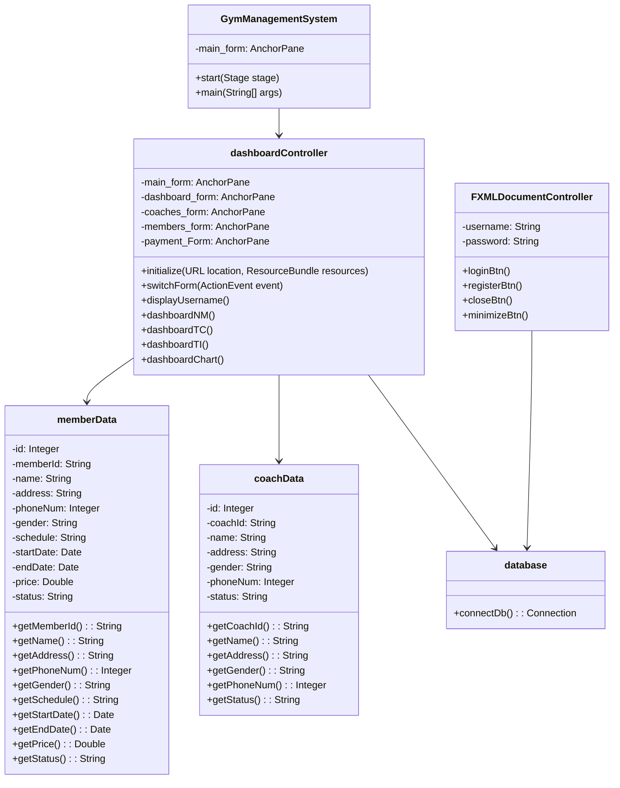

# Gym Management System

A comprehensive JavaFX-based Gym Management System that helps gym administrators manage members, coaches, equipment, and schedules efficiently.

## Project Overview

This project is developed as part of the Advanced Programming Course. It provides a complete solution for gym management with features including member management, coach management, equipment tracking, and scheduling.

## Group Members

[Add your group members' information here with their ID numbers]

## Features

- **Authentication System**
  - Secure login interface
  - Role-based access control
  - Password protection

- **Member Management**
  - Member registration and profile management
  - Membership tracking
  - Attendance monitoring
  - Payment history

- **Coach Management**
  - Coach profiles and schedules
  - Specialization tracking
  - Performance monitoring

- **Equipment Management**
  - Equipment inventory tracking
  - Maintenance scheduling
  - Usage monitoring

- **Schedule Management**
  - Class scheduling
  - Personal training sessions
  - Equipment booking

## Technical Requirements

- Java Development Kit (JDK) 8 or higher
- JavaFX
- MySQL Database
- Maven (for dependency management)

## Database Structure

The system uses a relational database with the following main tables:
1. Users
2. Members
3. Coaches
4. Equipment
5. Schedules
6. Payments
7. Attendance

## UML Class Diagram



## Installation and Setup

1. Clone the repository:
```bash
git clone [repository-url]
```

2. Set up the database:
   - Create a MySQL database
   - Import the database schema from the `database` folder

3. Configure the database connection:
   - Open `src/gymmanagementsystem/database.java`
   - Update the database credentials

4. Build and run the project:
   - Open the project in your preferred IDE
   - Build the project
   - Run `GymManagementSystem.java`

## User Interfaces

The system includes the following user interfaces:
1. Login Screen
2. Dashboard
3. Member Management
4. Coach Management
5. Equipment Management
6. Schedule Management
7. Reports
8. Settings

## Exception Handling

The system implements comprehensive exception handling for:
- Database connection issues
- Invalid user inputs
- Authentication failures
- Data validation errors
- File operations

## Contributing

1. Fork the repository
2. Create a feature branch
3. Commit your changes
4. Push to the branch
5. Create a Pull Request

## License

[Add your license information here]

## Contact

[Add contact information here]

## Acknowledgments

- JavaFX Documentation
- MySQL Documentation
- [Add any other acknowledgments] 